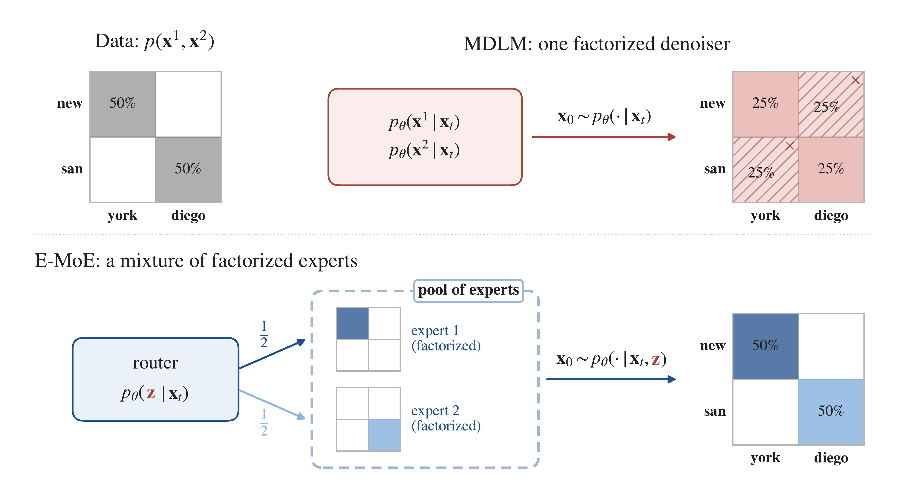

<h1 align="center">E-MoE: Enhanced Mixture-of-Experts<br>for Non-Factorized Diffusion Language Models</h1>

<div align="center">

**[Arseny Ivanov](https://scholar.google.com/citations?user=lvr79TEAAAAJ&hl=ru)**<sup>1,2</sup>,
**[Alexander Kolesov](https://scholar.google.com/citations?user=WyAI_wUAAAAJ&hl=ru)**<sup>2,1</sup>,
**[Alexander Korotin](https://scholar.google.com/citations?user=1rIIvjAAAAAJ&hl=ru)**<sup>2,1</sup>,
**[Ivan Oseledets](https://scholar.google.com/citations?user=5kMqBQEAAAAJ&hl=en)**<sup>1,2</sup>,
**[Mikhail Goncharov](https://mishgon.github.io)**<sup>1</sup>

<sup>1</sup>AXXX &nbsp; <sup>2</sup>Applied AI Institute

[](https://arxiv.org/abs/2609.37533)
[](https://huggingface.co/papers/2609.37533)

</div>

## News
- **[2026-09]** Vote for our paper at [HF Papers](https://huggingface.co/papers/2609.37533)!
- **[2026-09]** Our paper is accepted as a poster at the [DiffuLM workshop](https://7amin.github.io/diffulm-neurips2026/)!
- **[2026-09]** Paper released on arXiv.

## Official Code Repository

<p align="center">
  
</p>

**Overview of E-MoE.** A factorized denoiser (MDLM) samples tokens independently and puts mass on spurious pairs such as *new diego*. E-MoE uses MoE routing decisions as a discrete latent **z**: each expert is factorized, but the mixture over routes recovers the joint distribution.

## Repository Structure

```
e-moe/
├── main.py                  # entry point: training (mode=train) and sampling + metrics (mode=sample_eval)
├── algo.py                  # MDLM, SEDD, VADD, E-MoE / MDLM-MoE, AR: losses and samplers
├── trainer_base.py          # shared diffusion / Lightning logic (noise schedule, ancestral and analytic samplers)
├── dataloader.py            # data
├── metrics.py               # Gen-PPL/Entropy
├── models/
│   ├── dit.py               # DiT backbone (MDLM, SEDD, AR)
│   ├── dit_moe.py           # MoE-DiT backbone
│   └── dit_vadd.py          # VADD backbone
├── configs/                 # Hydra configs (algo, model, data, noise, lr_scheduler, ...)
├── scripts/                 # LM1B training and evaluation scripts
├── tools/mauve.py           # MAUVE
└── notebooks/
    └── toy_2d_experiments.ipynb   # 2-D toy experiments
```

## Setup

The code was run with Python 3.12, PyTorch 2.3.1 (CUDA 12.1) and FlashAttention 2.7.4 on NVIDIA H200 GPUs.

```bash
conda create -n emoe python=3.12 -y
conda activate emoe
pip install torch==2.3.1 torchvision==0.18.1 torchaudio==2.3.1 --index-url https://download.pytorch.org/whl/cu121
pip install -r requirements.txt
pip install flash_attn==2.7.4.post1 --no-build-isolation   
pip install mauve-text                           
```

**Data.** On the first run LM1B is downloaded from the Hugging Face Hub, tokenized with `bert-base-uncased` and
packed into blocks of 128 tokens. The result is cached in `$DATA_CACHE` (default `./data_cache`) and reused by all
later runs.

```bash
export DATA_CACHE=/path/to/data_cache
```

## Toy Experiments

[`notebooks/toy_2d_experiments.ipynb`](notebooks/toy_2d_experiments.ipynb) contains the complete 2-D toy study
(8-modes and Swiss-roll): data, the three models (MDLM, VADD, E-MoE), training over 3 seeds, the validity table
over NFE and the sample figures. It runs on a single GPU in about 30 minutes.

## Checkpoints

Final LM1B checkpoints after 1M training steps:

| Model | Checkpoint |
|---|---|
| E-MoE (536M total, 139M active) | [🤗 ArsenyIvanov/emoe-lm1b](https://huggingface.co/ArsenyIvanov/emoe-lm1b) |
| MDLM-MoE (536M total, 139M active) | [🤗 ArsenyIvanov/mdlm-moe-lm1b](https://huggingface.co/ArsenyIvanov/mdlm-moe-lm1b) |
| MDLM (139M) | [🤗 ArsenyIvanov/mdlm-lm1b](https://huggingface.co/ArsenyIvanov/mdlm-lm1b) |

All three are collected in the [E-MoE collection](https://huggingface.co/collections/ArsenyIvanov/e-moe-6ac5612f3e5371d47f84577c).
Each repository holds the EMA weights (`model.safetensors`) and the full Lightning checkpoint
(`training_checkpoint/step_1000000.ckpt`), which the scripts below load directly:

```bash
huggingface-cli download ArsenyIvanov/emoe-lm1b training_checkpoint/step_1000000.ckpt --local-dir checkpoints/emoe-lm1b
```

## Training

All models share the backbone size (DiT-small: 12 blocks, hidden size 768, 12 heads), data and budget: LM1B,
sequence length 128, global batch 512, 1M steps, AdamW with learning rate 3e-4 and 2.5k warmup steps, EMA 0.9999,
bf16.

```bash
bash scripts/train_lm1b_mdlm.sh        # MDLM
bash scripts/train_lm1b_sedd.sh        # SEDD
bash scripts/train_lm1b_vadd.sh        # VADD
bash scripts/train_lm1b_mdlm_moe.sh    # MDLM-MoE
bash scripts/train_lm1b_emoe.sh        # E-MoE
```

Each script uses 4 GPUs unless noted and writes to `outputs/lm1b_<model>/` (set `OUT` to change it). A checkpoint
is saved every 20k steps, and a stopped run resumes automatically from `checkpoints/last.ckpt` when the same command
is launched again. On 4×H200 a full run takes about 80 h for MDLM, 90 h for MDLM-MoE and 140 h for E-MoE, which
runs two backbone passes per step (clean and noisy input).

E-MoE is configured in [`configs/algo/emoe.yaml`](configs/algo/emoe.yaml): 8 experts per block, KL weight 1.0
between the clean-input and noisy-input routers, Gumbel temperature annealed from 1.0 to 0.1. MDLM-MoE is the same
config with `algo.det_moe=True algo.kl_weight=0.0 algo.lb_weight=0.01`.

## Sampling and Evaluation

**Generative perplexity and entropy.** `scripts/eval_lm1b.sh` samples 2000 unconditional sequences of 128 tokens
for every NFE in {1, 2, 4, 8, 16, 32, 64, 128} and reports their Gen-PPL/Entropy:

```bash
ALGO=emoe CKPT=checkpoints/emoe-lm1b/training_checkpoint/step_1000000.ckpt bash scripts/eval_lm1b.sh
# ALGO in {mdlm, sedd, vadd, mdlm_moe, emoe}
```

The metrics for each NFE are printed and logged to `outputs/eval_<ALGO>/nfe<N>/log`, and the samples are saved
to `outputs/eval_<ALGO>/nfe<N>/samples.json`.

**MAUVE.** The evaluation script also copies the samples to `outputs/mauve_samples/<ALGO>_nfe<N>.json`.
`tools/mauve.py` scores every file there against 2000 LM1B test sequences (GPT-2 Large features, mean ± std over
3 k-means seeds) and writes the table to `results_mauve.txt`:

```bash
python tools/mauve.py
```

**Inference options.**
- `algo.sparse_moe_infer=True` (default): at inference each token is computed only by its selected expert, so
  E-MoE and MDLM-MoE use the same FLOPs per token as MDLM. The outputs are identical to the dense computation used
  in training.
- `algo.eval_route_tau`: sampling temperature of the router prior (default 1.0). `0` collapses the mixture to
  greedy routes.

## Acknowledgements

The LM1B code is built on [DUO](https://github.com/s-sahoo/duo) (Apache 2.0, Copyright 2025 Subham Sekhar Sahoo),
and the VADD baseline follows [VADD](https://openreview.net/forum?id=yh7MV2V0ba) (Xie et al., 2026). We thank the
authors for releasing their code.

## Citation

If you find this work useful in your research, please consider citing our paper:

```bibtex
@article{ivanov2026emoe,
  title   = {E-MoE: Enhanced Mixture-of-Experts for Non-Factorized Diffusion Language Models},
  author  = {Ivanov, Arseny and Kolesov, Alexander and Korotin, Alexander and
             Oseledets, Ivan and Goncharov, Mikhail},
  journal = {arXiv preprint arXiv:2609.37533},
  year    = {2026}
}
```
